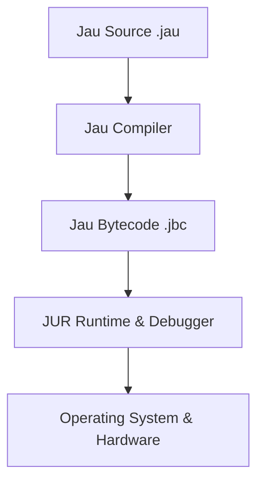

<div align="center">

<!-- Custom SVG Logo JAU -->
<svg width="160" height="160" viewBox="0 0 160 160" fill="none" xmlns="http://www.w3.org/2000/svg" style="margin-bottom: 15px;">
  <circle cx="80" cy="80" r="78" stroke="#4895ef" stroke-width="4"/>
  <path d="M40 120C60 80 80 80 100 120" stroke="#4895ef" stroke-width="6" stroke-linecap="round" />
  <path d="M60 40L80 80L100 40" stroke="#4895ef" stroke-width="6" stroke-linejoin="round" />
  <circle cx="80" cy="80" r="10" fill="#4895ef"/>
</svg>


<h1 style="font-weight: 900; font-family: 'Segoe UI', Tahoma, Geneva, Verdana, sans-serif; letter-spacing: 0.06em; color: #4895ef;">⚡ Jau Programming Language</h1>

<h3 style="font-family: 'Segoe UI', Tahoma, Geneva, Verdana, sans-serif;">You break it. <b style="color:#4895ef;">Jau</b> fixes it.</h3>

<br>

<div style="display:flex; justify-content:center; gap:10px; flex-wrap:wrap;">
  <a href="https://github.com/DeathAmir/Jau-lang/stargazers" target="_blank" style="text-decoration:none;">
    <svg height="28" width="120" viewBox="0 0 150 40" fill="#f9cc1b" xmlns="http://www.w3.org/2000/svg">
      <rect width="150" height="40" rx="6" fill="#1e293b"/>
      <text x="15" y="27" font-family="Segoe UI" font-weight="700" font-size="18" fill="#f9cc1b">⭐ Stars</text>
      <path d="M120 10v20l15-10-15-10z" fill="#f9cc1b"/>
    </svg>
  </a>
  <a href="https://github.com/DeathAmir/Jau-lang/network/members" target="_blank" style="text-decoration:none;">
    <svg height="28" width="130" viewBox="0 0 160 40" fill="#f97316" xmlns="http://www.w3.org/2000/svg">
      <rect width="160" height="40" rx="6" fill="#1e293b"/>
      <text x="15" y="27" font-family="Segoe UI" font-weight="700" font-size="18" fill="#f97316">🍴 Forks</text>
      <path d="M130 12h16v16h-16v-16z" fill="#f97316"/>
    </svg>
  </a>
  <a href="https://github.com/DeathAmir/Jau-lang/issues" target="_blank" style="text-decoration:none;">
    <svg height="28" width="140" viewBox="0 0 160 40" fill="#ef4444" xmlns="http://www.w3.org/2000/svg">
      <rect width="160" height="40" rx="6" fill="#1e293b"/>
      <text x="15" y="27" font-family="Segoe UI" font-weight="700" font-size="18" fill="#ef4444">📌 Issues</text>
      <circle cx="130" cy="20" r="10" stroke="#ef4444" stroke-width="2" fill="none"/>
    </svg>
  </a>
  <a href="https://github.com/DeathAmir/Jau-lang/blob/main/LICENSE" target="_blank" style="text-decoration:none;">
    <svg height="28" width="150" viewBox="0 0 160 40" fill="#a78bfa" xmlns="http://www.w3.org/2000/svg">
      <rect width="160" height="40" rx="6" fill="#1e293b"/>
      <text x="15" y="27" font-family="Segoe UI" font-weight="700" font-size="18" fill="#a78bfa">📜 License</text>
      <path d="M130 15l15 5-15 5v-10z" fill="#a78bfa"/>
    </svg>
  </a>
</div>

<br>

<div style="display:flex; justify-content:center; gap:12px; flex-wrap:wrap;">
  <div style="background:#2563eb; border-radius:10px; padding:5px 15px; font-family: 'Segoe UI', Tahoma, Geneva, Verdana, sans-serif; font-weight:600; color:#fff; box-shadow: 0 0 6px #2563eb;">version 0.1.0</div>
  <div style="background:#f97316; border-radius:10px; padding:5px 15px; font-family: 'Segoe UI', Tahoma, Geneva, Verdana, sans-serif; font-weight:600; color:#fff; box-shadow: 0 0 6px #f97316;">runtime: JUR</div>
  <div style="background:#22c55e; border-radius:10px; padding:5px 15px; font-family: 'Segoe UI', Tahoma, Geneva, Verdana, sans-serif; font-weight:600; color:#fff; box-shadow: 0 0 6px #22c55e;">platform: cross-platform</div>
  <div style="background:#ef4444; border-radius:10px; padding:5px 15px; font-family: 'Segoe UI', Tahoma, Geneva, Verdana, sans-serif; font-weight:600; color:#fff; box-shadow: 0 0 6px #ef4444;">status: experimental</div>
</div>

<br><br>

<a href="#english" style="font-family: 'Segoe UI', Tahoma, Geneva, Verdana, sans-serif; font-weight:600; color:#4895ef; text-decoration:none;">🇬🇧 English</a>

<br><br>

<div style="display:flex; justify-content:center; gap:18px; margin-bottom: 35px;">
  
</div>

---

<div align="center" style="font-family: 'Segoe UI', Tahoma, Geneva, Verdana, sans-serif; font-weight:700; font-size:28px; margin-bottom: 25px;">
  ⚙️ Jau Identity
</div>

<div align="center" style="font-family: 'Source Code Pro', monospace; font-weight:700; white-space: pre; font-size: 24px; color:#4895ef; letter-spacing:4px; line-height: 24px;">
      ██╗ █████╗ ██╗   ██╗ <br>
      ██║██╔══██╗██║   ██║ <br>
      ██║███████║██║   ██║ <br>
 ██   ██║██╔══██║██║   ██║ <br>
 ╚█████╔╝██║  ██║╚██████╔╝ <br>
  ╚════╝ ╚═╝  ╚═╝ ╚═════╝
</div>

---

# English

## 🚀 What is Jau

Jau is a modern experimental programming language focused on **speed**, **simplicity**, and **hardware‑level performance** without the painful complexity of traditional low‑level languages.

Designed for developers who want **power without suffering**.

---

## ⚡ Key Features

<ul style="list-style:none; padding-left:0; font-family: 'Segoe UI', Tahoma, Geneva, Verdana, sans-serif; font-weight:600; color:#27272a;">
<li style="margin-bottom: 12px;">🚀 <b>Ultra Fast Compilation</b></li>
<li style="margin-bottom: 12px;">🧠 <b>Simple Clean Syntax</b></li>
<li style="margin-bottom: 12px;">🔒 <b>Safe Runtime (JUR)</b></li>
<li style="margin-bottom: 12px;">📦 <b>Modular Package System with Dependency Resolver</b></li>
<li style="margin-bottom: 12px;">🌍 <b>Cross Platform Execution & WebAssembly Target</b></li>
<li style="margin-bottom: 12px;">⚙️ <b>Hardware‑Near Performance with Inline Assembly</b></li>
<li style="margin-bottom: 12px;">🔌 <b>Extensible Architecture & Plugin Support</b></li>
<li style="margin-bottom: 12px;">🛟 <b>Advanced Error Diagnostics and Debugger Integration</b></li>
<li>☁️ <b>Cloud Package Distribution via JauPM</b></li>
</ul>

---

## 🧠 Architecture



---

## 🧪 Example Code

### Variables

```rust
^Variables^

name = "DeathAmir"
age = 20

print(name)
print(age)
```

### Functions

```rust
^Function^

func greet(name) {
    if name == "Jau" {
        print("Hello Master")
    } else {
        print("Hello " + name)
    }
}

greet("Jau")
```

---

## 🛠 Toolchain

<table style="width:100%; font-family: 'Segoe UI', Tahoma, Geneva, Verdana, sans-serif; border-collapse: collapse;">
  <thead>
    <tr style="background:#e0e7ff; text-align:left;">
      <th style="padding: 10px; border: 1px solid #c7d2fe;">Tool</th>
      <th style="padding: 10px; border: 1px solid #c7d2fe;">Description</th>
    </tr>
  </thead>
  <tbody>
    <tr style="border-bottom: 1px solid #c7d2fe;">
      <td style="padding: 12px; border: 1px solid #c7d2fe;">jauc</td>
      <td style="padding: 12px; border: 1px solid #c7d2fe;">Jau Compiler with incremental build and lightning speed</td>
    </tr>
    <tr style="border-bottom: 1px solid #c7d2fe;">
      <td style="padding: 12px; border: 1px solid #c7d2fe;">jur</td>
      <td style="padding: 12px; border: 1px solid #c7d2fe;">Jau Secure Runtime with hardware acceleration</td>
    </tr>
    <tr style="border-bottom: 1px solid #c7d2fe;">
      <td style="padding: 12px; border: 1px solid #c7d2fe;">jaupm</td>
      <td style="padding: 12px; border: 1px solid #c7d2fe;">Modular Package Manager supporting cloud repositories</td>
    </tr>
    <tr style="border-bottom: 1px solid #c7d2fe;">
      <td style="padding: 12px; border: 1px solid #c7d2fe;">jaufmt</td>
      <td style="padding: 12px; border: 1px solid #c7d2fe;">Code Formatter with style guidelines and lint checks</td>
    </tr>
  </tbody>
</table>

---

## 📊 Performance Vision

<table style="width:100%; font-family: 'Segoe UI', Tahoma, Geneva, Verdana, sans-serif; border-collapse: collapse; text-align:center;">
  <thead>
    <tr style="background:#c7d2fe;">
      <th style="padding: 14px; border:1px solid #a5b4fc;">Language</th>
      <th style="padding: 14px; border:1px solid #a5b4fc;">Simplicity</th>
      <th style="padding: 14px; border:1px solid #a5b4fc;">Speed</th>
    </tr>
  </thead>
  <tbody>
    <tr style="border: 1px solid #a5b4fc; font-weight:bold;">
      <td style="padding: 14px;">Jau</td>
      <td style="color:#2563eb;">★★★★★</td>
      <td style="color:#2563eb; font-size: 20px;">🚀🚀🚀</td>
    </tr>
    <tr style="border: 1px solid #a5b4fc;">
      <td>Python</td>
      <td>★★★★★</td>
      <td>🐢</td>
    </tr>
    <tr style="border: 1px solid #a5b4fc;">
      <td>Go</td>
      <td>★★★</td>
      <td>🚀</td>
    </tr>
    <tr style="border: 1px solid #a5b4fc;">
      <td>C++</td>
      <td>★</td>
      <td>🔥🔥</td>
    </tr>
  </tbody>
</table>

---

## 📦 Installation

```bash
git clone https://github.com/DeathAmir/Jau-lang

cd Jau-lang

make build
```

---

## ▶ Run

```bash
jauc main.jau
jur main.jbc
```

---

## 📅 Roadmap

<ul style="list-style: none; font-family: 'Segoe UI', Tahoma, Geneva, Verdana, sans-serif; font-weight: 600; color:#27272a;">
  <li style="margin-bottom: 8px;">✅ Core Compiler</li>
  <li style="margin-bottom: 8px;">✅ JUR Runtime</li>
  <li style="margin-bottom: 8px;">⏳ Cloud Package Manager</li>
  <li style="margin-bottom: 8px;">⏳ WebAssembly Target</li>
  <li style="margin-bottom: 8px;">⏳ VSCode Extension</li>
  <li style="margin-bottom: 8px;">⏳ Jau Standard Library</li>
  <li style="margin-bottom: 8px;">⏳ Jau Debugger</li>
</ul>

---

## 🌐 Ecosystem

<ul style="list-style:none; font-family: 'Segoe UI', Tahoma, Geneva, Verdana, sans-serif; font-weight:600; color:#27272a;">
  <li>JUR Runtime & Debugger</li>
  <li>JauPM Package Manager & Cloud</li>
  <li>Jau Standard Library</li>
  <li>Jau Formatter & Lint</li>
  <li>Jau Language Server & VSCode Plugin</li>
</ul>

---

## 🤝 Contributing

Pull requests are welcome.

If you want to build the future of programming with <b style="color:#4895ef;">Jau</b>, join the project.

---

<div align="center" style="margin-top: 50px; padding: 20px; border: 2px solid #4895ef; border-radius: 12px; max-width: 320px; font-family: 'Segoe UI', Tahoma, Geneva, Verdana, sans-serif; font-weight: 700; color:#4895ef; letter-spacing: 1.1px;">
  © 2026 DeathAmir
  <br>
  <a href="https://github.com/deathamir" target="_blank" style="color:#4895ef; text-decoration:none;">GitHub Profile</a>
</div>

<br>

</div>
