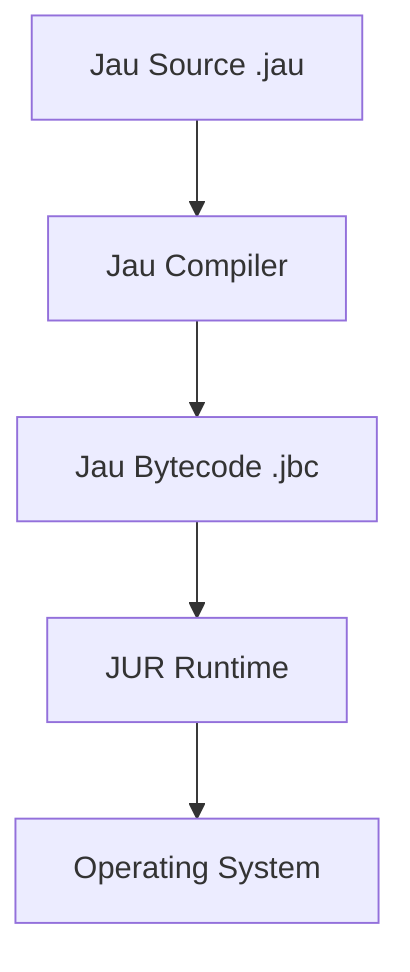

<div align="center">


<h1>Jau Programming Language</h1>

<h3>You break it. <b>Jau</b> fixes it.</h3>

<br>


<br>


<br><br>

<a href="#english">English</a>

<br><br>


</div>

---

<div align="center">

# Jau Identity

</div>

<div align="center">

      ██╗ █████╗ ██╗   ██╗
      ██║██╔══██╗██║   ██║
      ██║███████║██║   ██║
 ██   ██║██╔══██║██║   ██║
 ╚█████╔╝██║  ██║╚██████╔╝
  ╚════╝ ╚═╝  ╚═╝ ╚═════╝


</div>

---

<div align="center">

<svg width="420" height="180" viewBox="0 0 420 180" xmlns="http://www.w3.org/2000/svg">
  <defs>
    <linearGradient id="jg1" x1="0" y1="0" x2="1" y2="1">
      <stop offset="0" stop-color="#0f172a"/>
      <stop offset="1" stop-color="#1f2937"/>
    </linearGradient>
    <linearGradient id="jg2" x1="0" y1="1" x2="1" y2="0">
      <stop offset="0" stop-color="#22d3ee"/>
      <stop offset="1" stop-color="#3b82f6"/>
    </linearGradient>
  </defs>
  <rect x="10" y="10" width="400" height="160" rx="18" fill="url(#jg1)" stroke="#0b1220" stroke-width="2"/>
  <path d="M90 120c0-26 20-48 46-52 9-2 16-10 16-20 0-12-10-22-22-22-44 0-80 36-80 80 0 30 20 56 48 66 8 3 17-2 20-10 3-8-1-17-8-20-12-5-20-17-20-32z" fill="url(#jg2)"/>
  <path d="M210 42c20 14 26 36 18 56-8 20-28 34-51 36-16 2-29 14-29 30 0 16 13 30 30 30 41 0 78-25 94-63 16-38 6-82-27-108-7-6-18-5-24 2-6 7-5 18 2 24z" fill="url(#jg2)"/>
  <path d="M308 132c20-12 32-34 32-58 0-30-18-56-45-68-9-4-20 0-23 9-4 9 0 20 9 23 14 6 23 20 23 36 0 13-6 25-16 32-8 5-11 16-5 24 5 8 16 11 25 5z" fill="url(#jg2)"/>
  <text x="210" y="118" text-anchor="middle" font-size="46" font-family="Verdana, sans-serif" fill="#e2e8f0" letter-spacing="3">JAU</text>
</svg>

</div>

---

<div align="center">

<svg width="920" height="200" viewBox="0 0 920 200" xmlns="http://www.w3.org/2000/svg">
  <defs>
    <linearGradient id="bg" x1="0" y1="0" x2="1" y2="1">
      <stop offset="0" stop-color="#0f172a"/>
      <stop offset="1" stop-color="#111827"/>
    </linearGradient>
    <linearGradient id="glow" x1="0" y1="0" x2="1" y2="0">
      <stop offset="0" stop-color="#22d3ee"/>
      <stop offset="1" stop-color="#3b82f6"/>
    </linearGradient>
  </defs>
  <rect x="10" y="10" width="900" height="180" rx="18" fill="url(#bg)" stroke="#0b1220" stroke-width="2"/>
  <circle cx="140" cy="100" r="48" fill="none" stroke="url(#glow)" stroke-width="6"/>
  <path d="M118 100c0-12 10-22 22-22 6 0 10-5 10-10 0-6-5-10-10-10-24 0-44 20-44 44 0 17 10 31 24 38 5 2 11-1 13-6 2-5-1-11-6-13-6-3-9-8-9-15z" fill="url(#glow)"/>
  <path d="M164 78c10 7 13 19 9 30-4 11-15 18-27 19-8 1-14 7-14 15 0 9 7 15 15 15 22 0 41-13 49-33 8-20 3-44-14-58-4-4-11-3-13 1-4 4-3 11 1 13z" fill="url(#glow)"/>
  <text x="520" y="110" text-anchor="middle" font-size="44" font-family="Verdana, sans-serif" fill="#e2e8f0" letter-spacing="2">Jau Runtime Architecture</text>
  <path d="M760 70h90" stroke="url(#glow)" stroke-width="4"/>
  <path d="M760 100h110" stroke="url(#glow)" stroke-width="4"/>
  <path d="M760 130h80" stroke="url(#glow)" stroke-width="4"/>
</svg>

</div>

---

# English

## What is Jau

Jau is a modern experimental programming language focused on speed, simplicity, and hardware-level performance without the painful complexity of traditional low-level languages.

Designed for developers who want power without suffering.

---

## Key Features

- Ultra Fast Compilation  
- Simple Clean Syntax  
- Safe Runtime JUR  
- Modular Package System  
- Cross Platform Execution  
- Hardware-Near Performance  
- Extensible Architecture  
- Deterministic Builds  
- Native Interop Layer  
- Zero Cost Abstractions  
- Predictable Memory Model  
- Sandboxed Execution Modes  

---

## Architecture



---

## Example Code

### Variables

```rust
^Variables^

name = "DeathAmir"
age = 20

print(name)
print(age)
```

### Functions

```rust
^Function^

func greet(name) {
    if name == "Jau" {
        print("Hello Master")
    } else {
        print("Hello " + name)
    }
}

greet("Jau")
```

---

## Toolchain

| Tool | Description |
|-----|-------------|
| jauc | Jau Compiler |
| jur | Jau Runtime |
| jaupm | Package Manager |
| jaufmt | Code Formatter |
| jauan | Analyzer |
| jaudb | Debugger |
| jaulsp | Language Server |

---

## Performance Vision

| Language | Simplicity | Speed |
|--------|--------|--------|
| Jau | Outstanding | Extreme |
| Python | Outstanding | Slow |
| Go | Good | Fast |
| C++ | Low | Very Fast |

---

## Installation

```bash
git clone https://github.com/deathamir/jau-lang

cd jau-lang

make build
```

---

## Run

```bash
jauc main.jau
jur main.jbc
```

---

## Roadmap

- Core Compiler  
- JUR Runtime  
- Cloud Package Manager  
- WebAssembly Target  
- VSCode Extension  
- Jau Standard Library  
- Jau Debugger  
- JIT Mode  
- Native FFI  
- Package Registry  
- Ahead-of-Time Optimizer  

---

## Ecosystem

- JUR Runtime  
- JauPM Package Manager  
- Jau Standard Library  
- Jau Formatter  
- Jau Language Server  
- Jau Analyzer  
- Jau Debugger  
- Jau CI Templates  

---

## Contributing

Pull requests are welcome.

If you want to build the future of programming with Jau, join the project.

---

<div align="center">

<div style="display:inline-block; padding:14px 22px; border:1px solid #30363d; border-radius:10px; background:#0d1117; color:#c9d1d9; font-family:Verdana, sans-serif;">
  <svg width="18" height="18" viewBox="0 0 24 24" fill="#c9d1d9" xmlns="http://www.w3.org/2000/svg" style="vertical-align:middle; margin-right:8px;">
    <path d="M12 2a10 10 0 1 0 10 10A10.011 10.011 0 0 0 12 2Zm0 2a8 8 0 1 1-8 8A8.009 8.009 0 0 1 12 4Zm0 2a2 2 0 0 0-2 2h2v4h4v-2h-2V8a2 2 0 0 0-2-2Z"/>
  </svg>
  Copyright DeathAmir
</div>

</div>

---

<div align="center">


<br><br>


</div>
