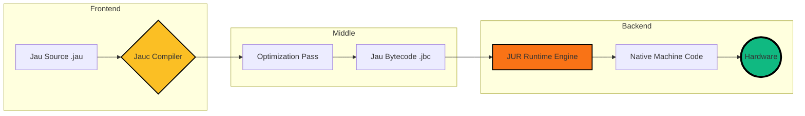

<div align="center">


<h1>⚡ The Jau Programming Language</h1>

<h3><i>"You break it. <b>Jau</b> heals it."</i></h3>

<p>A high-performance, memory-safe language designed for the next generation of systems engineering.</p>

<br>

[](https://github.com/DeathAmir/jau-lang)
[](https://github.com/DeathAmir/jau-lang)
[](https://github.com/DeathAmir/jau-lang/issues)
[](https://github.com/DeathAmir/jau-lang/blob/main/LICENSE)

<br>


<br><br>


</div>

---

## 💎 The Jau Philosophy

Jau is not just another syntax; it’s a hardware-obsessed ecosystem built to eliminate the bridge between **Developer Happiness** and **Machine Efficiency**.

- **Zero-Cost Abstractions:** High-level code, low-level execution.
- **The JUR Engine:** A custom-built Virtual Machine optimized for instant startup and predictive execution.
- **Safety by Default:** Integrated memory protection without a heavy Garbage Collector.

---

## ⚡ Technical Superpowers

| Feature | Description |
| :--- | :--- |
| **🚀 Warp Speed** | Jauc leverages LLVM-style optimizations for lightning-fast binary generation. |
| **🧠 Cognitive Syntax** | Designed to be read by humans, but executed by gods. |
| **🔒 JUR Isolation** | The Jau Runtime ensures no rogue memory access can crash your host system. |
| **📦 JauPM** | Native dependency resolution with zero-config overhead. |
| **📡 Hot Reloading** | Modify system-level logic without restarting the runtime. |

---

## 🧬 Architecture Flow



---

## 🧪 Experience Jau

### Functional Prowess
```rust
^ Function Definition ^

func calculate_power(base, exp) {
    match exp {
        0 => return 1,
        _ => return base * calculate_power(base, exp - 1)
    }
}

let result = calculate_power(2, 8)
print("Result: " + result) // Result: 256
```

### System Interaction
```rust
^ Memory Safety & Pointers ^

func handle_stream(data*) {
    if data.is_valid() {
        print(data.read_buffer())
    } else {
        panic("Memory violation prevented by JUR")
    }
}
```

---

## 🛠 Pro Toolchain

| Command | Tool | Responsibility |
|:---|:---|:---|
| `jauc` | **The Architect** | Compiles source into optimized JBC bytecode. |
| `jur` | **The Executor** | High-performance runtime environment. |
| `jaupm` | **The Courier** | Lightning-fast package and dependency manager. |
| `jaufmt` | **The Artist** | Opinionated code formatter for ultimate readability. |
| `jaudbg` | **The Seer** | Real-time memory and state debugger. |

---

## 📊 Benchmark Vision

<div align="center">

| Metric | Jau | Rust | Go | Python |
| :--- | :---: | :---: | :---: | :---: |
| **Syntax Simplicity** | 💎 💎 💎 💎 💎 | 💎 💎 | 💎 💎 💎 💎 | 💎 💎 💎 💎 💎 |
| **Compilation Speed** | 🚀 🚀 🚀 🚀 | 🐢 | 🚀 🚀 🚀 | ⚡ (N/A) |
| **Runtime Performance**| 🔥 🔥 🔥 🔥 | 🔥 🔥 🔥 🔥 🔥 | 🔥 🔥 🔥 | 🧊 |
| **Memory Safety** | ✅ | ✅ | ✅ | ✅ |

</div>

---

## 📦 Rapid Deployment

```bash
# Clone the core
git clone https://github.com/DeathAmir/jau-lang.git

# Enter the forge
cd jau-lang

# Build the ecosystem
make install
```

### Quick Run
```bash
jauc example/hello.jau
jur example/hello.jbc
```

---

## 🗺 The Grand Vision

- [x] **Phase 1:** Core Compiler & JUR Alpha
- [x] **Phase 2:** Basic Pointers & Type Inference
- [ ] **Phase 3:** JauPM Cloud Registry
- [ ] **Phase 4:** WebAssembly (WASM) Target Support
- [ ] **Phase 5:** LLVM Integration for Native Binaries
- [ ] **Phase 6:** VSCode Language Server (LSP)

---

## 🤝 Join the Revolution

Jau is open-source and always will be. We are looking for dreamers who want to redefine systems programming.

1. **Fork** the repo.
2. **Hack** the core.
3. **Submit** a PR.
4. **Ascend** to the contributor list.

---

<div align="center">

### Built with ❤️ by DeathAmir

[](https://twitter.com/DeathAmir)
[](https://discord.gg/DeathAmir)


</div>
