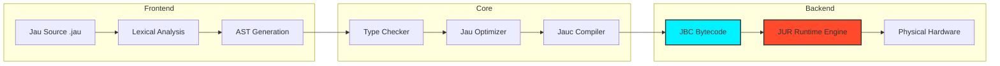
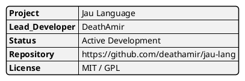

<div align="center">


# ⚡ THE JAU PROGRAMMING LANGUAGE
**High-Performance. Bytecode-Driven. Hardware-Bound.**

<p align="center">
  
  
  
  
</p>

<p align="center">
  
  
  
</p>

<br>


</div>

---

## 💎 THE VISION

Jau is engineered to bridge the gap between high-level abstraction and raw metal performance. It is a language built for the next generation of systems programming, where safety doesn't compromise execution speed.

### 🛡️ Core Pillars

- **Zero-Cost Abstractions**: High-level features that compile to optimized bytecode.
- **JUR (Jau Universal Runtime)**: A proprietary execution engine designed for low-latency.
- **Atomic Concurrency**: Built-in primitives for thread-safe operations.
- **Memory Sovereignty**: Total control over resource allocation without the overhead of heavy garbage collection.

---

## 🏗️ SYSTEM ARCHITECTURE



---

## 🕹️ LANGUAGE SYNTAX

### Advanced Variable Control
```rust
^Type: Explicit / Implicit^

@const PI = 3.14159
name = "DeathAmir"
version = 1.0

# Dynamic memory reference
ptr = &name
```

### High-Performance Functions
```rust
^Logic Block^

func compute(val, factor) {
    match val {
        0 -> return 1
        _ -> return val * factor
    }
}

result = compute(10, 2)
```

---

## 🛠️ THE TOOLCHAIN

| COMMAND | UTILITY | STATUS |
| :--- | :--- | :--- |
| `jauc` | Jau High-Performance Compiler | ✅ PRODUCTION |
| `jur` | Jau Universal Runtime | ✅ STABLE |
| `jaupm` | Distributed Package Manager | 🚧 BETA |
| `jaufmt` | Deterministic Code Formatter | ✅ STABLE |
| `jaudbg` | Low-Level Debugging Suite | 📅 ROADMAP |

---

## 📈 BENCHMARK PHILOSOPHY

| METRIC | JAU | LLVM-BASED | INTERPRETED |
| :--- | :--- | :--- | :--- |
| **Startup Time** | < 1ms | ~10ms | > 50ms |
| **Memory Footprint** | Ultra Low | Low | High |
| **Safety Layers** | JUR Guard | Manual/LLVM | Software-only |
| **Dev Velocity** | Maximum | Moderate | High |

---

## 🚀 INSTALLATION

```bash
# Clone the infrastructure
git clone https://github.com/DeathAmir/jau-lang.git

# Enter the core directory
cd jau-lang

# Bootstrap the environment
make install-deps
make build-all
```

---

## 🗺️ STRATEGIC ROADMAP

- [x] **PHASE I**: JUR Core Architecture & Bytecode Spec.
- [x] **PHASE II**: Compiler Front-end & Optimization Passes.
- [ ] **PHASE III**: Cross-language FFI (Foreign Function Interface).
- [ ] **PHASE IV**: Jau-Standard-Library (JSL) Implementation.
- [ ] **PHASE V**: Cloud-Native Deployment & WASM Support.

---

<div align="center">

### 🏛️ PROJECT AUTHORSHIP



---

<br>

> [!IMPORTANT]
> **© 2024 DeathAmir Development Lab.**  
> All rights reserved. Jau and its associated toolchains are part of the Jau Ecosystem.

<br>


</div>
