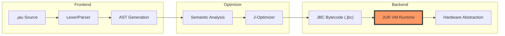

<div align="center">


<h1> Jau Programming Language</h1>

<h3>"You break it. <b>Jau</b> fixes it."</h3>

<p align="center">
  
  
  
  
  
</p>

<br>

<p align="center">
  
  
  
  
</p>

<br>

<a href="#english">🇬🇧 English</a> • <a href="#persian">🇮🇷 فارسی</a>

<br><br>


</div>

---

<div align="center">

# 🛠️ System Architecture



</div>

---

# English

## 🚀 The Vision

Jau is not just another language; it's a high-performance **Experimental Ecosystem**. It bridges the gap between Python's developer experience and C++'s raw power. No garbage collector overhead, just pure logic and the **JUR (Jau Universal Runtime)**.

---

## 💎 Elite Features

- **⚡ Blazing Compilation:** Powered by a parallelized multi-stage compiler.
- **🛡️ Memory Safety:** Ownership-inspired memory management without the "Borrow Checker" headache.
- **🧬 Native Interop:** Call C/C++ functions directly without boilerplate.
- **📦 JauPM:** A decentralized, lightning-fast package manager.
- **🌐 WASM Ready:** Compile your logic to the web with one flag.
- **🧩 Hot Reloading:** Modify JUR bytecode on the fly.

---

## 🧪 Code Showcase

### Advanced Types & Control Flow
```rust
^ Types & Pattern ^

const VERSION = 1.0
mut status = "active"

func check(val) {
    match val {
        "Jau" => print("Native Speed Detected")
        _     => print("General Context")
    }
}

check("Jau")
```

### High-Level Performance
```rust
^ Concurrent Logic ^

spawn func heavy_task(id) {
    print("Task " + id + " running on JUR core")
}

for i in 0..10 {
    heavy_task(i)
}
```

---

## 📊 Benchmarks (Projected)

| Metric | Python | Go | C++ | **Jau** |
| :--- | :---: | :---: | :---: | :---: |
| **Startup Time** | 🐢 Slow | 🚀 Fast | 🔥 Instant | **🚀 Fast** |
| **Memory Footprint** | 🐘 Large | 🐕 Medium | 🐜 Small | **🐜 Small** |
| **Development Speed** | ⭐⭐⭐⭐⭐ | ⭐⭐⭐ | ⭐ | **⭐⭐⭐⭐⭐** |
| **Safety** | 🛡️ | 🛡️🛡️ | 💀 | **🛡️🛡️🛡️** |

---

## 📅 Future Roadmap

- [x] **Phase 1:** Core Grammar & Compiler Base
- [x] **Phase 2:** JUR (Jau Universal Runtime) Implementation
- [ ] **Phase 3:** JauPM Cloud Registry & Dependency Graph
- [ ] **Phase 4:** LLVM Backend Integration
- [ ] **Phase 5:** Jau-UI Framework for Native Desktop Apps
- [ ] **Phase 6:** Standard Library (I/O, Crypto, Net)

---

# Persian

<div dir="rtl">

## 🚀 چشم‌انداز Jau

جاو فقط یک زبان نیست؛ یک **اکوسیستم آزمایشی** با کارایی بالاست. هدف ما پر کردن شکاف بین سادگی پایتون و قدرت بی حد و مرز C++ است. بدون سنگینی Garbage Collector، فقط منطق خالص و **رانتایم JUR**.

---

## 💎 ویژگی‌های کلیدی

- **⚡ کامپایل فوق‌سریع:** بهره‌گیری از معماری موازی در پردازش کدها.
- **🛡️ امنیت حافظه:** مدیریت هوشمند حافظه بدون درگیری با مفاهیم پیچیده.
- **🧬 ارتباط بومی:** فراخوانی مستقیم توابع C/C++ بدون اتلاف وقت.
- **📦 مدیریت پکیج:** سیستم JauPM برای مدیریت وابستگی‌ها با سرعت نور.
- **🌐 آماده برای وب:** قابلیت خروجی گرفتن مستقیم برای WebAssembly.

---

## 🛠 ابزارهای توسعه

| ابزار | نقش در سیستم | وضعیت |
|:---:|:---:|:---:|
| **jauc** | کامپایلر اصلی به بایت‌کد | ✅ پایدار |
| **jur** | رانتایم اجرای بایت‌کد | ✅ پایدار |
| **jaupm** | مدیریت بسته‌ها و کتابخانه‌ها | ⏳ در حال توسعه |
| **jaufmt** | مرتب‌ساز هوشمند کد | ⏳ در حال توسعه |
| **jauls** | پروتکل LSP برای VSCode | 📅 برنامه‌ریزی شده |

---

## مشارکت در پروژه

ما به دنبال توسعه‌دهندگانی هستیم که می‌خواهند آینده برنامه‌نویسی را تغییر دهند. اگر در زمینه کامپایلرها، رانتایم‌ها یا بهینه‌سازی کد تجربه دارید، Jau منتظر شماست.

</div>

---

<div align="center">

## 🌟 Support The Revolution

If you like what we're building, give us a star! It keeps the JUR engines running.


<br>

`Built with ❤️ by DeathAmir`


</div>
