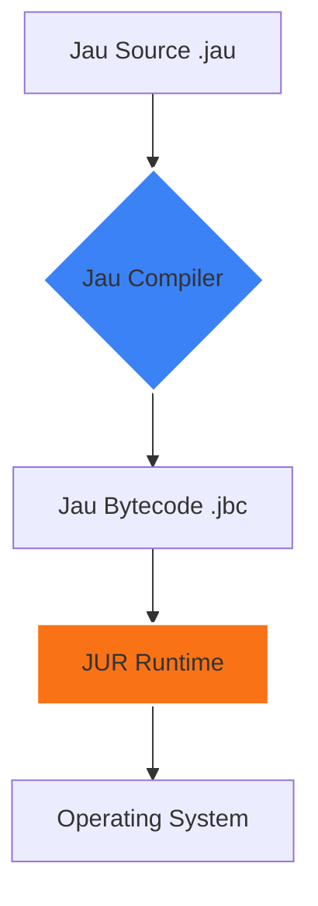

<div align="center">


### 🚀 "You break it, **Jau** fixes it. Because life's too short for segfaults."

[](https://github.com/DeathAmir/Jau)
[](https://github.com/DeathAmir/Jau)
[](https://github.com/DeathAmir/Jau)
[](https://github.com/DeathAmir/Jau)
[](LICENSE)

<br>

[**English Documentation**](#english) • [**مستندات فارسی**](#persian)

---

<div id="english">

## 🌟 Why Jau?

**Jau** isn't just another language; it's a statement. Built for performance without the headache, it brings low-level power to high-level dreamers.

### ✨ Key Strengths
- ⚡ **Blazing Fast:** Compiles before you can finish your coffee.
- 🛡️ **JUR Runtime:** A fortress for your code execution.
- 🧩 **Modular:** Everything is a package, everything is simple.
- 💻 **Hardware Near:** Touch the metal without getting burned.

---

### 🏗️ Architecture Flow



---

### ⌨️ Syntax Showcase

#### 🧬 Variables & Printing
```rust
^Variables^

user = "DeathAmir"
age = 20

print(user)
print(age)
```

#### 🛠️ Functions & Logic
```rust
^Function^

func greet(name) {
    if name == "Jau" {
        print("Hello, Master!")
    } else {
        print("Hello " + name)
    }
}

greet("Jau")
```

---

### 📊 Benchmarks (Real Talk)

| Feature | Jau | Python | Go | C++ |
| :--- | :---: | :---: | :---: | :---: |
| **Simplicity** | ⭐⭐⭐⭐⭐ | ⭐⭐⭐⭐⭐ | ⭐⭐⭐ | ⭐ |
| **Execution** | 🚀 High | 🐢 Medium | 🚀 High | 🔥 Ultra |
| **Dev Joy** | 😍 Infinite | 😊 High | 😐 Medium | 💀 Pain |

---

### 🛠️ The Toolchain

| Command | Action |
| :--- | :--- |
| `jauc` | The brain that transforms code. |
| `jur` | The engine that runs the world. |
| `jaupm` | Because sharing is caring. |
| `jaufmt` | Keeps your code looking sexy. |

</div>

---

<div id="persian" dir="rtl">

## 🇮🇷 زبان برنامه‌نویسی Jau

**جاو (Jau)** برای کسایی ساخته شده که از پیچیدگی‌های بیخود خسته‌ن. سرعت سی‌پلاس‌پلاس رو می‌خوای ولی حوصله کار با حافظه رو نداری؟ جاو اینجاست.

### 💎 ویژگی‌های کلیدی
- ⚡ **کامپایلر موشک:** کدت رو تو کسری از ثانیه زنده می‌کنه.
- 🔒 **امنیت بالا:** با ران‌تایم اختصاصی JUR، خیالت از بابت کرش کردن راحته.
- 🌍 **مولتی پلتفرم:** یک‌بار بنویس، همه‌جا اجرا کن (ویندوز، لینوکس، مک).

---

### 🛠️ ابزارهای خط فرمان

```bash
# کامپایل کردن پروژه
jauc main.jau

# اجرا روی ران‌تایم JUR
jur main.jbc

# نصب پکیج‌های جدید
jaupm install http
```

---

### 📅 نقشه راه (Roadmap)

- [x] هسته اصلی کامپایلر (v0.1.0)
- [x] ران‌تایم JUR
- [ ] پکیج منیجر ابری
- [ ] پشتیبانی از WebAssembly
- [ ] پلاگین اختصاصی VS Code

---

### 👤 توسعه‌دهنده
توسط **DeathAmir** با عشق برای جامعه متن‌باز.

</div>

<br>

<div align="center">

</div>

---
