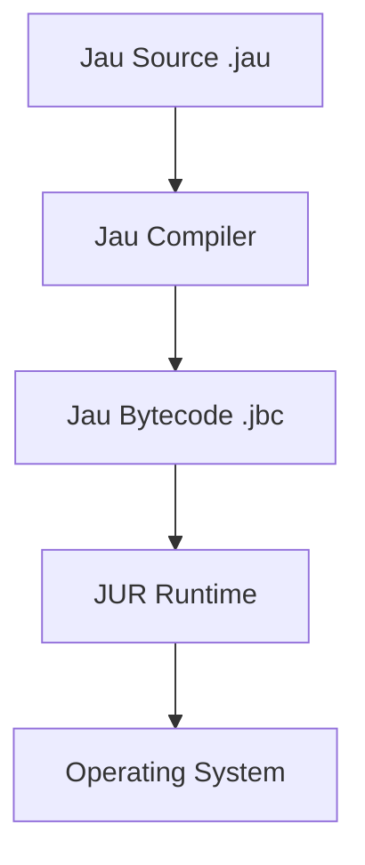
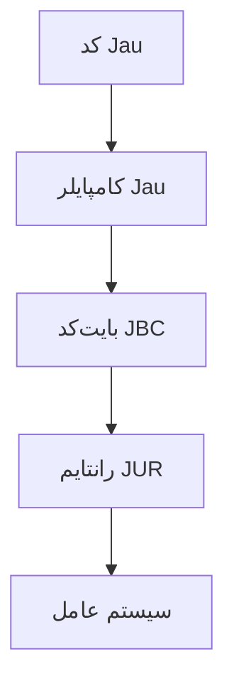

<div align="center">


<h1>⚡ Jau Programming Language</h1>

<h3>You break it. <b>Jau</b> fixes it.</h3>

<br>


<br>


<br><br>

<a href="#english">🇬🇧 English</a> • <a href="#persian">🇮🇷 فارسی</a>

<br><br>


</div>

---

<div align="center">

# ⚙️ Jau Identity

</div>

<div align="center">

```
      ██╗ █████╗ ██╗   ██╗
      ██║██╔══██╗██║   ██║
      ██║███████║██║   ██║
 ██   ██║██╔══██║██║   ██║
 ╚█████╔╝██║  ██║╚██████╔╝
  ╚════╝ ╚═╝  ╚═╝ ╚═════╝
```

</div>

---

# English

## 🚀 What is Jau

Jau is a modern experimental programming language focused on **speed**, **simplicity**, and **hardware‑level performance** without the painful complexity of traditional low‑level languages.

Designed for developers who want **power without suffering**.

---

## ⚡ Key Features

- 🚀 Ultra Fast Compilation  
- 🧠 Simple Clean Syntax  
- 🔒 Safe Runtime (JUR)  
- 📦 Modular Package System  
- 🌍 Cross Platform Execution  
- ⚙️ Hardware‑Near Performance  
- 🔌 Extensible Architecture  

---

## 🧠 Architecture



---

## 🧪 Example Code

### Variables

```rust
^Variables^

name = "DeathAmir"
age = 20

print(name)
print(age)
```

### Functions

```rust
^Function^

func greet(name) {
    if name == "Jau" {
        print("Hello Master")
    } else {
        print("Hello " + name)
    }
}

greet("Jau")
```

---

## 🛠 Toolchain

| Tool | Description |
|-----|-------------|
| jauc | Jau Compiler |
| jur | Jau Runtime |
| jaupm | Package Manager |
| jaufmt | Code Formatter |

---

## 📊 Performance Vision

| Language | Simplicity | Speed |
|--------|--------|--------|
| Jau | ⭐⭐⭐⭐⭐ | 🚀 |
| Python | ⭐⭐⭐⭐⭐ | 🐢 |
| Go | ⭐⭐⭐ | 🚀 |
| C++ | ⭐ | 🔥 |

---

## 📦 Installation

```bash
git clone https://github.com/DeathAmir/Jau

cd Jau

make build
```

---

## ▶ Run

```bash
jauc main.jau
jur main.jbc
```

---

## 📅 Roadmap

- ✅ Core Compiler
- ✅ JUR Runtime
- ⏳ Cloud Package Manager
- ⏳ WebAssembly Target
- ⏳ VSCode Extension
- ⏳ Jau Standard Library
- ⏳ Jau Debugger

---

## 🌐 Ecosystem

- JUR Runtime
- JauPM Package Manager
- Jau Standard Library
- Jau Formatter
- Jau Language Server

---

## 🤝 Contributing

Pull requests are welcome.

If you want to build the future of programming with **Jau**, join the project.

---

# Persian

<div dir="rtl">

## 🚀 زبان برنامه‌نویسی Jau

جاو یک زبان برنامه‌نویسی مدرن و آزمایشی است که برای **سرعت بالا، سادگی و قدرت نزدیک به سخت‌افزار** طراحی شده.

هدفش اینه که قدرت زبان‌های سطح پایین رو بدون دردسرهای معمول در اختیار برنامه‌نویس قرار بده.

---

## ⚡ ویژگی‌ها

- سرعت کامپایل بسیار بالا  
- سینتکس ساده و تمیز  
- ران‌تایم امن JUR  
- سیستم پکیج ماژولار  
- اجرا روی چند پلتفرم  
- عملکرد نزدیک به سخت‌افزار  

---

## معماری



---

## نمونه کد

```rust
name = "DeathAmir"

print(name)
```

---

## ابزارها

| ابزار | توضیح |
|------|------|
| jauc | کامپایلر |
| jur | ران‌تایم |
| jaupm | پکیج منیجر |
| jaufmt | فرمت‌کننده کد |

---

## نقشه راه

- هسته کامپایلر
- ران‌تایم JUR
- پکیج منیجر ابری
- پشتیبانی WebAssembly
- افزونه VSCode

---

## مشارکت

اگر دوست داری در توسعه این زبان شرکت کنی  
می‌تونی Pull Request بفرستی.

---

### سازنده

DeathAmir

</div>

---

<div align="center">

## ⭐ Support The Project


<br><br>


</div>
